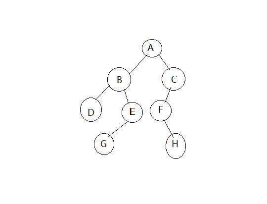

# 数据结构 
#### 1.线性表常用的两种存储结构是什么？它们对存储单元有什么要求？
 顺序存储和链式存储。 
 线性表的顺序表示指的是用一组地址连续的存储单元一次存储线性表的数据元素；线性表的顺序存储特点是用一组任意的存储单元存储线性表的数据元素(这组存储单元可以是连续的，也可以是不连续的)。 

#### 2.栈、队列和数组都是特殊的线性表，试说明它们各自的特殊性和特点。
 栈：栈是限定仅在表尾进行插入和删除操作的线性表。栈中元素后进先出； 
 队列：队列是一种先进先出的线性表，它只允许在表的一端进行插入、而在另一端进行删除； 
 数组： 
#### 3.请分别写出图所示二叉树的前序遍历、中序遍历和后序遍历序列。

 前序遍历：A-B-D-E-G-C-F-H; 
 中序遍历：D-B-G-E-A-F-H-C; 
 后续遍历：D-G-E-B-H-F-C-A。 